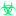
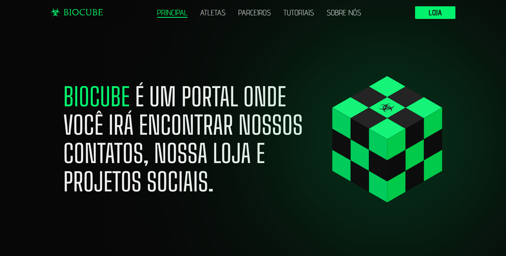
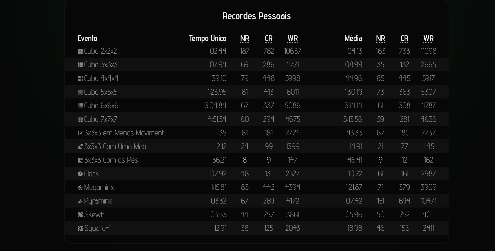
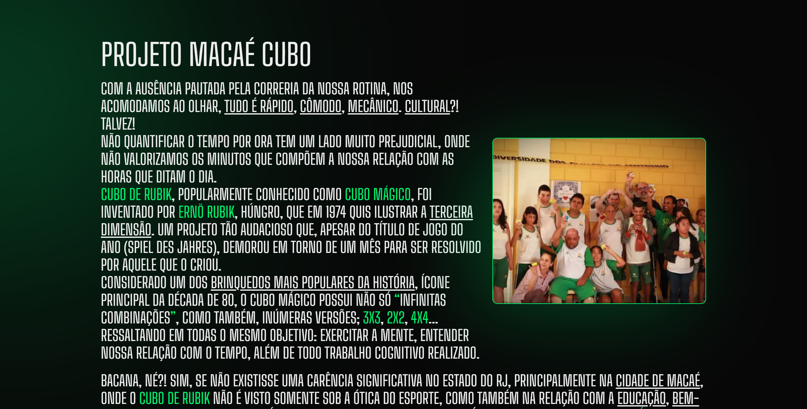
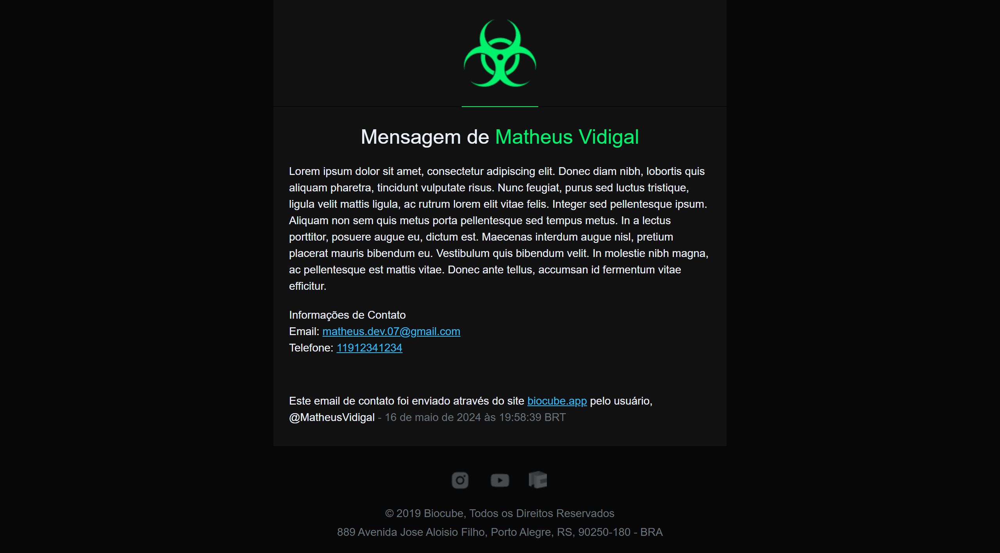
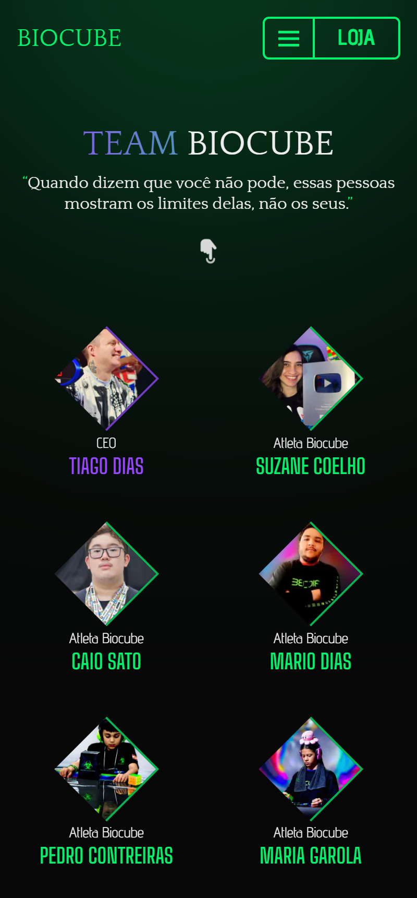
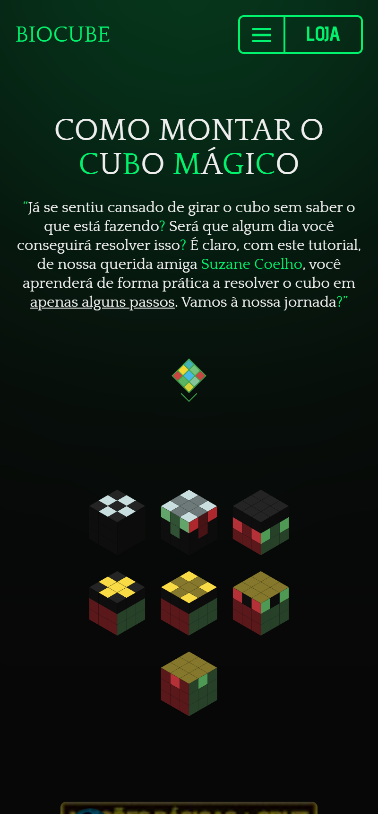
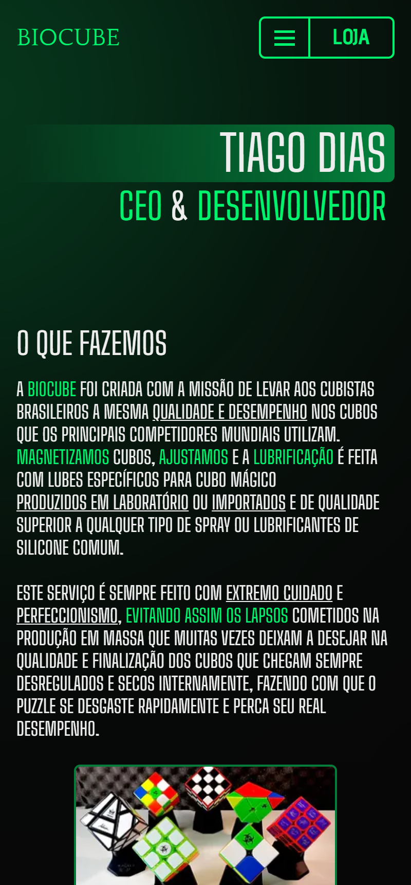
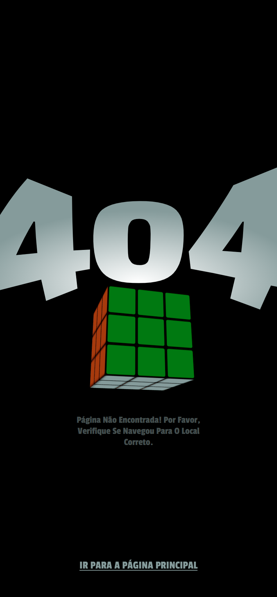

<h1 align="center">
    
</h1>
<p align="center">
    
    
    
    <a href="https://github.com/NyctibiusVII/BiocubeBlog/blob/main/LICENSE">
        
    </a>
</p>
<p align="center">
    <a href="#biocubeblog-">Projeto</a>&nbsp;&nbsp;&nbsp;|&nbsp;&nbsp;&nbsp;
    <a href="#tecnologias-">Tecnologias</a>&nbsp;&nbsp;&nbsp;|&nbsp;&nbsp;&nbsp;
    <a href="#layout-">Layout</a>&nbsp;&nbsp;&nbsp;|&nbsp;&nbsp;&nbsp;
    <a href="#licença-%EF%B8%8F">Licença</a>
</p>

# BiocubeBlog 
Biocube é um portal onde você irá encontrar nossos contatos, nossa loja e projetos sociais. 🤹‍♀️☣

#### Funcionalidades
* Link para a loja online
* Página de atletas patrocinados
    * __Info__: Acesso a performance, dados WCA e redes sociais
* Tutorial ilustrativo de como montar um cubo mágico
    * __Youtube__: ft. _Suzane Coelho_
    * __Ilustração__: _Imagens svg personalizadas_
* Fale conosco
    * __Formulário__: _Nome, Sobrenome, Email, Telefone e Mensagem_
    * __Email__: _Html personalizado_

## Tecnologias 🚀
Esse projeto foi desenvolvido com as seguintes tecnologias:
- [ReactJS](https://pt-br.reactjs.org)
- [Typescript](https://www.typescriptlang.org)
- [NextJS](https://nextjs.org)
- [TailwindCSS](https://tailwindcss.com)
- [ReactEmail](https://react.email)
- [ThreeJS](https://threejs.org)

## Layout 🚧
### Desktop Screenshot
<div style="display: flex; flex-direction: 'column'; align-items: 'center';">
<!-- Responsive, 1280 x 650, 65% (Laptop L) -->
    
    
    
    
    
    
</div>

### Mobile Screenshot
<div style="display: flex; flex-direction: 'row';">
<!-- Responsive, 400 x 860, 60% (Mobile X11T) -->
    
    
    
    
    
</div>

## Rodando o projeto 🚴🏻‍♂️
#### "Só vou dar uma olhadinha...":
  <a href="https://biocube.vercel.app">👩🏻‍🏫 Site hospedado na Vercel 📄</a>

#### Na sua maquina:
```bash
# Clone o repositório
$ git clone https://github.com/NyctibiusVII/BiocubeBlog.git

# Acesse a pasta do projeto no terminal
$ cd BiocubeBlog

# Instale as dependências com o gerenciador de pacotes de sua preferência
$ npm install   /   yarn add

# Execute o projeto
$ npm run dev   /   yarn dev

# O projeto roda na porta: 3000

# Acesse http://localhost:$PORT *Ex: Cuidado para não ligar dois ou mais projetos na mesma porta.
```

## Contribuição 💭
Confira a página de [contribuição](./CONTRIBUTING) para ver como começar uma discussão e começar a contribuir.

## Licença ⚖️
Este projeto está sob a licença do MIT. Veja o arquivo [LICENSE](https://github.com/NyctibiusVII/BiocubeBlog/blob/main/LICENSE) para mais detalhes.

## Contribuidores 🦸🏻‍♂️
<a href="https://github.com/NyctibiusVII/BiocubeBlog/graphs/contributors">
    
</a>

<br/>
<br/>

###### Feito com ❤️ por Matheus Vidigal 👋🏻 [Entre em contato!](https://www.linkedin.com/in/matheus-vidigal-nyctibiusvii)